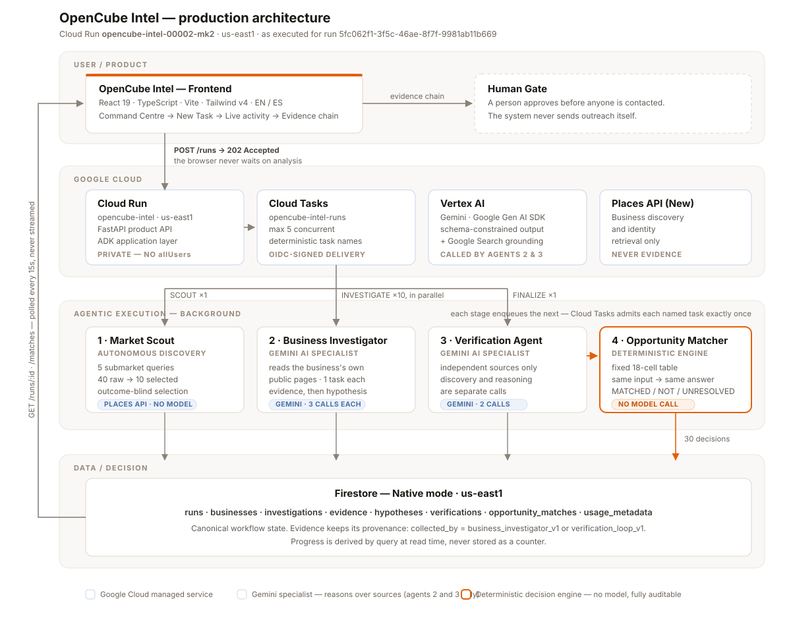

# OpenCube Intel

**Don't personalize outreach first. Prove there's a reason to reach out.**

*Less outreach. Better reasons.*

OpenCube Intel lets you hand a market-opportunity task to a specialised
intelligence team, close the tab, and come back to a set of decisions — each one
attached to the evidence that produced it, and most of them saying *don't
contact this business about this*.

Built for the Google All Things Agentic Hackathon — **Taskmaster** category.

**Try it — no account, nothing to install:** <https://opencube-intel-judge-djgg4gps5q-ue.a.run.app>
Read-only Judge Mode, serving the real completed production runs.

Repository: <https://github.com/guillermowfg-ai/opencube-vertical-intelligence>

<!-- Screenshot: docs/images/command-center.png — the Command Centre with a task running -->

---

## The problem

Prospecting local businesses by hand is slow. That is the obvious friction, and
it is the one every tool on the market attacks.

It is not the real one.

The real problem is not *finding* businesses. It is working out whether there is
a legitimate, observable, evidence-backed reason to contact any of them. Anyone
can generate a list of two hundred med spas in Miami-Dade in about four seconds.
Nobody can tell you which of them actually has a problem you can solve — and the
cost of being wrong is not a wasted email. It is a business owner who now
associates your name with someone who invented a problem to sell them something.

Today's prospecting stack, AI-assisted or not, runs in one direction:

> find lead → personalize message → contact

The personalization gets better every year. The *reason* never gets checked at
all. Better writing on top of an unverified premise is a more convincing wrong
guess.

## The idea

OpenCube Intel reverses the order:

> find business → investigate → challenge the hypothesis → verify what matters →
> **reject unsupported reasons** → only then identify a potential fit

The system's job is not to produce leads. It is to destroy reasons that do not
survive contact with evidence, and to hand a human the few that do — with the
sources attached.

This came out of running the outreach side of OpenCube Studio, an AI-automation
practice working with local service businesses. The friction it removes is
friction we had.

## What OpenCube Intel does

You assign a task. Four specialists execute it in the background, on Google
Cloud, without you watching:

| | Specialist | Type | What it does |
|---|---|---|---|
| 1 | **Market Scout** | AI agent | Searches a market neighbourhood by neighbourhood via the Places API, filters deterministically to the target county, and selects a shortlist — without ever looking at website content, so it cannot prefer businesses that look like they'll produce an interesting answer. |
| 2 | **Business Investigator** | AI agent | Reads each business's own public pages and records plain observations, each tied to the URL it came from. Evidence and interpretation are stored as separate records. |
| 3 | **Verification Agent** | AI agent | Goes looking for what sources the business *does not control* say about the same claim. A business can never be its own second opinion. |
| 4 | **Opportunity Matcher** | **Deterministic decision engine** | Puts the two side by side and applies a fixed 18-cell table. Same evidence in, same answer out. |

<!-- Screenshot: docs/images/team.png — the Team screen -->

**The Opportunity Matcher is not an LLM agent, and calling it one would give
away the whole point.** Generative models investigate and verify; deterministic
policy decides commercial eligibility. The one part of the system that decides
whether a business gets contacted is the one part that cannot improvise, cannot
be prompted into a different answer, and can be read line by line in
[`opportunity_matcher.py`](opencube-intel/app/investigator/opportunity_matcher.py).

## Why this is different

**`DO NOT CONTACT` is a successful outcome.**

Not a null result, not a filtered-out row, not an error. It is a first-class
product output, persisted with its reasoning and rendered in the interface with
the evidence chain that produced it. A run that rejects every opportunity it
evaluated has worked perfectly.

Three outcomes exist, and the interface never collapses them:

- **Worth exploring** (`MATCHED`) — the reason survived. A person still approves
  before anyone is contacted.
- **Do not contact on this basis** (`NOT_MATCHED`) — this specific reason does
  not hold. Not a verdict on the business.
- **Do not contact yet** (`UNRESOLVED`) — the evidence disagrees with itself.
  Needs a human.

`UNRESOLVED` is the interesting one. Three cells of the reconciliation table
resolve there rather than to a commercial answer, and they are frozen. In
particular: *we found the opposite, but one outside source agrees with the
original claim* never becomes `MATCHED`. Independent supporting evidence does
not erase original evidence that contradicted the opportunity.

## How the agentic workflow works

`POST /runs` validates, writes a `QUEUED` run to Firestore, enqueues one
discovery task, and returns `202` — typically in well under a second. Nothing
analytical happens on that request. Everything after it is background work
driven by Cloud Tasks:

1. **SCOUT** discovers businesses, persists them along with an `Investigation`
   record for each, then fans out one Cloud Task per business.
2. **INVESTIGATE ×10** run in parallel, one business per task, three
   schema-constrained Gemini calls each — one per opportunity definition in the
   V1 catalog.
3. **FINALIZE ×1** selects which hypotheses to verify, runs the Verification
   Agent over them, runs the Opportunity Matcher over *every* hypothesis, and
   writes the terminal run state.

FINALIZE is scheduled exactly once, and not by a database flag. Every business
worker that observes all investigations terminal tries to create a Cloud Task
named `finalize-{run_id}`; Cloud Tasks admits one and returns `AlreadyExists` to
the rest, which is swallowed as the success signal it is. A flag would have
needed the commit and the enqueue to be one atomic operation — and a worker that
died between them would strand the run forever with every other worker already
convinced it had lost the race.

Progress is derived by query at read time, never stored as a counter. Under
at-least-once delivery a counter is the single largest duplication hazard: one
redelivery corrupts it silently and permanently. The consequence is that the
whole production path needs no Firestore transaction anywhere.

## Product experience

<!-- Screenshot: docs/images/new-task.png — the New Task flow -->

```
Command Centre → New Task → Market Opportunity Intelligence → Required team
  → Task configuration → Task instruction → Launch
    → Background activity → Task brief → Results
      → Opportunity evidence chain → Human Gate
```

The task-creation flow shows you the team before you start, states the settings
that are fixed and why, and writes out the instruction your team will actually
be given — built from the real execution parameters, not from a free-text box
the backend would silently ignore. `POST /runs` accepts no instruction field, so
inventing one would be a lie told in the user's own language.

Once launched you can close the page. The live view polls every 15 seconds and
shows each specialist's real state derived from persisted progress. A failed
poll keeps the last good screen with an error rather than blanking it.

The interface is a lens, never a second brain: it never classifies a hypothesis,
decides a match, or recomputes a count. Every analytical value on screen was
produced by the pipeline and persisted before the browser asked for it. It ships
in English and Spanish.

## Real production proof

One controlled production run against real businesses, on real Google Cloud
infrastructure:

**`5fc062f1-3f5c-46ae-8f7f-9981ab11b669`** · Cloud Run revision
`opencube-intel-00002-mk2` · `us-east1`

| | |
|---|---|
| Raw candidates discovered | 40 (5 submarket queries × 8) |
| Businesses selected | 10 |
| Opportunities evaluated | 30 (3 definitions × 10 businesses) |
| Independent verification checks | 10 |
| Deterministic match decisions | 30 |
| **MATCHED** | **2** |
| **NOT_MATCHED** | **27** |
| **UNRESOLVED** | **1** |
| Final status | `COMPLETED` |

Observed execution: `POST /runs` returned `202` in ~0.52 s client-side (~0.35 s
server-side). Then one SCOUT task `200`, ten `/tasks/investigate` `200`, one
`/tasks/finalize` `200`. **No task retries.** Five investigations began within
roughly three seconds of each other and overlapped for approximately 20–30
seconds. End-to-end: **≈3m54s**.

These are the timings of one observed run, not a service-level guarantee.

**The number that matters is 27 of 30.** Ninety percent of the possible reasons
to contact somebody were rejected by the system that generated them. OpenCube
did not manufacture more leads. It removed reasons that could not be defended.

## Evidence-first decision making

Every observation is stored as an `Evidence` record with the URL it came from,
and evidence is kept separate from the interpretation drawn out of it. Gemini
reasons only over source material explicitly supplied to it; every source URL it
emits is validated downstream against the set of URLs actually fetched, so a
fabricated citation cannot survive into the record.

Verification evidence and investigator evidence share one collection and are
told apart by provenance — `collected_by = verification_loop_v1` versus
`business_investigator_v1`. That separation is deliberate and load-bearing: it
is what lets you distinguish *what OpenCube observed* from *what an independent
source later found*, in the data and on screen.

Verification also splits two facts that are easy to conflate: whether the check
*ran* (`IN_PROGRESS` / `COMPLETED` / `FAILED`) and what it *found* (`SUPPORTS` /
`CONTRADICTS` / `INSUFFICIENT_EVIDENCE`). A check that found no independent
source at all is recorded as exactly that — never as "insufficient evidence".

## Architecture



Full detail, including the reconciliation table and the duplicate-suppression
points, is in [`docs/architecture.md`](docs/architecture.md). The reasoning
behind every significant decision — including the ones that were rejected — is
in [`DECISIONS.md`](DECISIONS.md).

## Google Cloud + Gemini stack

**AI / agent frameworks.** Two Google agent frameworks are used, at two
different layers, and it is worth being precise about which does what.

- **Google Gen AI SDK** (`google-genai`) — **the framework the OpenCube
  analytical specialists are built on.** Market Scout, the Business
  Investigator and the Verification Agent call Gemini
  (`gemini-3.6-flash`) through **Vertex AI** using this SDK, with response
  schemas constraining every analytical output. The Gen AI SDK is itself one of
  the hackathon's accepted Google agent frameworks.
- **Google ADK** (`google-adk`) — **the application and runtime layer.** The
  project was scaffolded with `google-agents-cli` (v1.4.0), and the service
  runs as an ADK FastAPI application (`get_fast_api_app`) with ADK's runner,
  session and artifact services and its OpenTelemetry export to Cloud Trace.
  The product API, the internal task handlers and the frontend read routes are
  all mounted into that ADK application.
- **Google Search grounding**, used for source *discovery* only in the
  Verification Agent's first call — its prose is never persisted as evidence.

Two clarifications so nothing here is read as more than it is:

- `app/agent.py` still contains the **ADK scaffold's sample `root_agent`**, kept
  as generated. It is not part of the OpenCube production analytical workflow
  and is not invoked by any stage of a run.
- The **Opportunity Matcher is deterministic** and makes **no model call at
  all** — neither SDK reaches it.

**Backend** — Python 3.12 · FastAPI · Pydantic · uvicorn

**Google Cloud** — Cloud Run · Cloud Tasks · Firestore (Native mode) · Places
API (New) · IAM + OIDC · Cloud Logging / Cloud Trace

**Frontend** — React 19 · TypeScript · Vite 7 · Tailwind CSS v4 · React Router 7

**Testing / tooling** — pytest · pytest-asyncio · Vitest · ruff · ty · codespell ·
uv · Terraform (generated, retained)

**Data sources** — Google Places API (New) for business discovery and identity;
each business's own public web pages, fetched directly; independent third-party
web sources discovered via Google Search grounding. Public web and business data
only: no probing of private channels, no unsolicited contact.

## Real example: when the answer is "Do not contact"

<!-- Screenshot: docs/images/do-not-contact.png — the evidence chain ending in DO NOT CONTACT -->

**No Filter Medical Spa** — opportunity: *hard to book online*
(hypothesis `3c66ec03-0202-41c3-83cb-30dc9d1c371d`)

The Business Investigator read the business's own pages and found prominent
booking paths. The Verification Agent went to an independent source and also
found booking availability. The suspected booking friction was contradicted from
both directions, and the deterministic Matcher rejected the outreach reason.

**Result: do not contact on this basis.**

That means one specific thing, and it is worth being precise about it: this
claimed problem is not a defensible reason to contact this business. It does not
mean never contact them. Another reason may hold. Conflating the two would be
exactly the sloppiness the product exists to remove.

**Rejuvaline Medspa at Flamingo** shows the other side. The Investigator's own
research came back `INSUFFICIENT_EVIDENCE`. Independent verification came back
`SUPPORTS`. One outside source agreeing with a claim our own research could not
substantiate is not enough to promote it into a commercial opportunity, so the
Matcher returned `UNRESOLVED`.

**Result: do not contact yet — human review.**

The system had an obvious opportunity to talk itself into a lead, and the table
would not let it.

## Taskmaster / BYOF

**The friction (BYOF).** Deciding who genuinely deserves outreach, when the
evidence for "they have this problem" is scattered across a business's own site
and whatever the rest of the web says about them. Real friction from running
outreach for an AI-automation practice, not a scenario invented for a
submission.

**Why this is a Taskmaster project, not a chatbot.** There is no conversation
anywhere in the product. You assign a task and close the tab. Execution is
asynchronous, multi-step, and survives the browser: one queued run fans out into
twelve Cloud Tasks across four specialists, coordinating through Firestore with
no operator in the loop. The user's next interaction is with the *result*.

**Proof of Action.** Every claim the system makes is traceable to a persisted
artifact — the evidence record and its source URL, the hypothesis, the
independent verification, and the deterministic reason code behind the decision.
The interface renders that chain in order: what we saw → what it might mean →
what the evidence said → what we concluded → what happens next. The proof is not
a log of what the agent did. It is the reasoning, addressable and re-readable
after the fact.

## Local development

### Prerequisites

- **Python 3.12** (the project supports ≥3.11,<3.14; the container is
  `python:3.12-slim`)
- **[uv](https://docs.astral.sh/uv/getting-started/installation/)** — all Python
  dependency management
- **Node.js 20+ and npm** (developed on Node 22)
- **[Google Cloud CLI](https://cloud.google.com/sdk/docs/install)** — only if you
  want to run against real Google services

### Frontend + fixture backend — no cloud credentials, no spend

The fastest way to see the product. The fixture server serves the real routers
over an in-memory store, and every `OpportunityMatch` in it is produced by the
real `opportunity_matcher.build_match`, so the UI is exercised against the real
reconciliation table.

```bash
# terminal 1 — backend on http://127.0.0.1:8000
cd opencube-intel
uv sync
uv run python scripts/dev_fixture_api.py

# terminal 2 — frontend on http://127.0.0.1:5173
cd frontend
npm install
npm run dev
```

The fixture server is a development harness. It is never imported by `app/`, is
not deployed (the Dockerfile copies only `./app`), and must never be pointed at
a real environment.

### Real backend — requires Google Cloud

```bash
cd opencube-intel
uv sync
cp .env.example .env          # then edit GOOGLE_CLOUD_PROJECT
uv run uvicorn app.fast_api_app:app --port 8000
```

Authenticate with Application Default Credentials — the app uses ADC for Vertex
AI, Firestore, Cloud Tasks *and* the Places API (there is no API key anywhere in
this project):

```bash
gcloud auth application-default login
gcloud auth application-default set-quota-project <your-project-id>
gcloud config set project <your-project-id>
```

The quota project matters: the Places client sends `X-Goog-User-Project` from
`GOOGLE_CLOUD_PROJECT`.

Enable the APIs the workflow uses: `aiplatform`, `firestore`, `cloudtasks`,
`places`, `run`, `cloudbuild`, `logging`, `cloudtrace` (as
`aiplatform.googleapis.com`, `firestore.googleapis.com`,
`cloudtasks.googleapis.com`, `places.googleapis.com`, and so on).

**Backend environment variables**

| Variable | Where | Purpose |
|---|---|---|
| `GOOGLE_GENAI_USE_VERTEXAI` | `.env` | `true` — route Gemini through Vertex AI |
| `GOOGLE_CLOUD_PROJECT` | `.env` | Project for Vertex AI, Firestore, Cloud Tasks, Places quota |
| `GOOGLE_CLOUD_LOCATION` | `.env` | Model location (defaults to `global`) |
| `ALLOW_ORIGINS` | optional | Comma-separated CORS origins; unset in the single-origin setup |
| `TASKS_QUEUE` | cloud only | Cloud Tasks queue name |
| `TASKS_LOCATION` | cloud only | Queue region |
| `SERVICE_URL` | cloud only | Base URL tasks call back into, and the OIDC audience |
| `TASK_INVOKER_SA` | cloud only | Service account Cloud Tasks signs deliveries as |

The four `cloud only` variables are required to enqueue anything. Without them
`POST /runs` fails fast with a clear configuration error rather than half-starting
a run — locally, use the fixture server or the per-stage scripts instead.

**Frontend environment variables**

| Variable | Purpose |
|---|---|
| `OPENCUBE_API_URL` | Dev-server proxy target for `/api` (default `http://127.0.0.1:8000`) |
| `VITE_API_BASE_URL` | Client-side API base (default `/api`) |
| `VITE_EXECUTION_MODE` | `readonly` hides the launch action and makes `createTask` refuse |

`/api` is the API base in every environment, so the browser never needs CORS and
the backend's auth posture is untouched.

### Running one stage at a time

Each stage has a script under `opencube-intel/scripts/`, useful for inspecting a
single specialist without a full run. **`run_market_scout.py`,
`run_investigator_demo.py` and `run_verification_loop.py` call paid Google APIs.**
`run_opportunity_matcher.py` and `dev_fixture_api.py` do not.

## Cloud deployment

**A judge does not need to deploy any of this to review the repository.** The
fixture path above runs the whole interface with no cloud account. This section
documents the deployed topology for reproducibility.

The service is one Cloud Run deployment serving the product API, the internal
task handlers and the frontend read routes from a single ADK application — one
service, one deployment, one identity.

The accepted deployment used the equivalent of:

```bash
cd opencube-intel
gcloud run deploy opencube-intel --source . \
  --region us-east1 \
  --project <your-project-id> \
  --service-account <runtime-sa-email> \
  --timeout 1800 \
  --no-allow-unauthenticated \
  --update-env-vars TASKS_QUEUE=opencube-intel-runs,TASKS_LOCATION=us-east1,SERVICE_URL=<service-url>,TASK_INVOKER_SA=<runtime-sa-email>
```

The placeholders stay placeholders. `<runtime-sa-email>` is the runtime service
account — the same identity Cloud Tasks signs its OIDC deliveries as — and it is
deliberately not written out here; publishing a real service-account address
buys nothing and widens the target. `GOOGLE_GENAI_USE_VERTEXAI`,
`GOOGLE_CLOUD_PROJECT` and `GOOGLE_CLOUD_LOCATION` come from the container
environment (see `.env.example` and the Terraform), so `--update-env-vars` only
needs to add the four Cloud Tasks variables.

Alongside it you need a Firestore database in Native mode (`us-east1`), a Cloud
Tasks queue `opencube-intel-runs` in `us-east1` with max-concurrent-dispatches
5, and a runtime service account holding `roles/run.invoker` **scoped to this one
service** plus Firestore, Vertex AI and Places access. `--timeout 1800` is not
arbitrary: it must be at least the largest per-task dispatch deadline, which is
FINALIZE's 1800 s.

`opencube-intel/deployment/terraform/` contains the Terraform generated by the
Agents CLI scaffold. **It is scaffold material, retained for reference, and it is
not the source of truth for the Production Execution V1 deployment.** It predates
the Cloud Tasks and Firestore work: it declares no `TASKS_QUEUE`,
`TASKS_LOCATION`, `SERVICE_URL` or `TASK_INVOKER_SA`, and does not enable the
Firestore, Cloud Tasks or Places APIs. The `gcloud run deploy` invocation above
and the surrounding prose describe the deployed topology; the Terraform does not.

## Testing

```bash
cd opencube-intel && uv run pytest tests/unit    # 189 tests, fully mocked
cd frontend && npm test                          # 78 tests
cd frontend && npm run typecheck && npm run lint
```

Both suites pass with no cloud credentials and no spend: `firestore_store` and
`tasks_client` are replaced function-by-function with in-memory fakes that store
documents exactly as Firestore would hold them.

`tests/integration/` exercises the ADK scaffold agent and the server directly and
**does call Gemini** — it needs credentials and costs money.

Some tests are structural rather than behavioural, and deliberately so: one
asserts via AST that the orchestrator never calls a forbidden Firestore writer
and never references a match or verification enum, because "orchestration
transports execution, it never reinterprets an analytical result" is an
invariant that a code review will eventually stop enforcing and a test will not.

## Security & judge access

The production Cloud Run service is **private**. There is no `allUsers` binding;
only the runtime service account holds `run.invoker`, scoped to that one service,
and Cloud Tasks signs every internal delivery with an OIDC token for that same
account. The `X-CloudTasks-TaskName` check in the handlers is hygiene that makes
an accidental hand-rolled call obvious — it is trivially spoofable and is never
the access control.

### Hosted Judge Mode — <https://opencube-intel-judge-djgg4gps5q-ue.a.run.app>

A **second, separate** Cloud Run service serving the same interface over the
real completed production data, read-only. Starting a task is not disabled
there so much as absent, at four independent layers:

- **The interface** is compiled with `VITE_EXECUTION_MODE=readonly`, which is a
  build-time constant — the launch request is eliminated from the bundle, not
  hidden in it.
- **The server** (`app/judge_app.py`) registers only `GET` routes. `POST /runs`
  and the three `/tasks/*` handlers are never registered, so they answer `404`
  rather than `401`, and a method guard refuses every non-read verb before
  routing.
- **The runtime identity** is a dedicated service account holding Firestore
  *viewer* and nothing else — no Vertex AI, no Cloud Tasks, no ability to
  invoke the production service. A route bug could not spend money.
- **The private core is untouched.** `opencube-intel` still requires IAM
  authentication; anonymous requests to it get `403`.

Public access is granted by disabling the Cloud Run invoker IAM check **on the
judge service only** — the organisation enforces Domain Restricted Sharing, so
an `allUsers` binding is refused, and no organisation policy was changed to work
around it. There is no `allUsers` or `allAuthenticatedUsers` binding anywhere in
the project.

Product Mode, with execution enabled, is the authenticated experience.

## V1 boundaries

Recorded rather than papered over. These are scope decisions and future work,
each with its reasoning in [`DECISIONS.md`](DECISIONS.md).

- The workflow is intentionally frozen to the V1 market configuration — one
  vertical, one county, five submarket queries, ~10 businesses. A mismatched
  request is a `422`, not a best-effort run that would silently produce nonsense.
- Exactly one executable task template exists, because exactly one workflow is
  genuinely executable. The interface never advertises work the backend cannot do.
- The backend core stays private; the public judge deployment will be read-only.
- Progress is polled, not streamed.
- No stuck-run watchdog yet: a run whose worker dies past its retry budget stays
  non-terminal until someone looks.
- Cloud Tasks delivery is at-least-once. Duplicate suppression is applied at
  every stage, but an instance killed *mid-investigation* leaves partial evidence
  that the terminal-status guard cannot suppress, so the retry can write a second
  set with fresh UUIDs. Bounded by `maxAttempts=3` and a 600 s deadline against
  ~40–90 s of real work. The fix is deterministic evidence IDs, which would touch
  the frozen provenance model.
- `provider_capabilities` are recorded context on a run; they do not yet steer
  analytical behaviour, and the interface says so.
- Aggregate read routes stream whole collections and group in memory — correct at
  ~10 businesses and ~30 matches per run, and the first thing to revisit when that
  stops being true.

## Repository structure

```
opencube-intel/              backend — FastAPI on Google ADK
  app/
    api/                     production routes (/runs, /tasks/*) + read routes
    investigator/            the four specialists, catalogs, Firestore, Cloud Tasks
    fast_api_app.py          ADK application; all routers mounted here
  scripts/                   per-stage proof scripts + the local fixture server
  tests/unit/                189 fully-mocked tests
  deployment/terraform/      generated scaffold, retained
frontend/                    React 19 operator interface
  src/product/               task templates, team, execution mode
  src/pages/                 one file per screen
  src/i18n/                  English + Spanish dictionaries
docs/
  architecture.md            architecture in full, with Mermaid source
  architecture.svg           rendered diagram
  video-plan.md              demo storyboard
  devpost-draft.md           submission copy
DECISIONS.md                 every significant decision and why
```

## Built during the hackathon

This project is submitted by **Guillermo Paz** as an individual entrant.

OpenCube Studio is the pre-existing brand I operate under — the AI-automation
practice whose prospecting friction this product addresses, and the source of
the logo in `design-references/`. That brand context predates the hackathon.

**OpenCube Intel — including the submitted codebase and implementation — was
designed and built by me, Guillermo Paz, during the hackathon submission
period.** The repository's Git history evidences it: the initial commit is
dated 23 August 2026, every commit falls inside the submission period, and no
pre-existing application code was imported.

Standard open-source libraries and frameworks were used as dependencies (the
Google Gen AI SDK, Google ADK, FastAPI, Pydantic, React, Vite, Tailwind), and
the project was scaffolded with Google's `agents-cli` (v1.4.0) — its generated
files, including the retained Terraform and the ADK scaffold's sample agent in
`app/agent.py`, are identifiable as such in the Git history. AI coding
assistants were used throughout development.

---

<sub>OpenCube Intel · Google All Things Agentic Hackathon · Taskmaster</sub>
