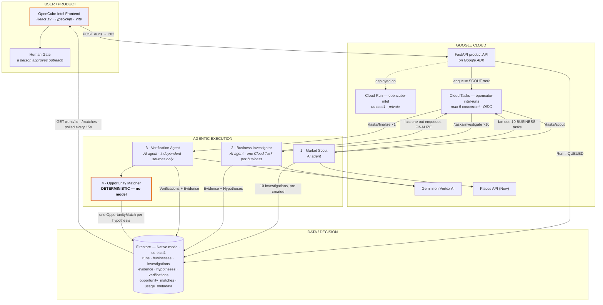

# OpenCube Intel — Architecture

This document describes the architecture that actually ran the accepted
production run `5fc062f1-3f5c-46ae-8f7f-9981ab11b669`. It is descriptive, not
aspirational: every box below exists in the repository and executed in Google
Cloud.

The rendered diagram lives at [`architecture.svg`](./architecture.svg). The
Mermaid source below is the same graph, kept in version control so the picture
and the prose can never drift apart.

---

## 1. The shape of the system

Four layers, and the boundaries between them are the point.

| Layer | What lives there | Why the boundary matters |
|---|---|---|
| **User / product** | The OpenCube Intel React interface | The operator assigns a task and reads evidence. It never decides anything. |
| **Agentic execution** | Market Scout, Business Investigator, Verification Agent, Opportunity Matcher | Three specialists reason with a model. The fourth does not — and must not. |
| **Google Cloud** | Cloud Run, Cloud Tasks, Vertex AI, Places API | Background execution, identity, and the model. |
| **Data / decision** | Firestore | The single canonical record of what happened and why. |

---

## 2. Diagram

---

## 3. The request path, step by step

**`POST /runs` never investigates.** It validates the request, writes a
`QUEUED` Run to Firestore, enqueues exactly one SCOUT task, and returns `202`
with a `run_id`. In the accepted run this took roughly 0.35 s server-side. No
model is called on this path, so the user's browser never waits on analysis.

**SCOUT** issues one Places text-search per frozen submarket (five
neighbourhoods across Miami-Dade), merges and deterministically filters the
candidates, persists the selected businesses *and* an `Investigation` record
for each of them, and only then fans out one Cloud Task per business.
Pre-creating the Investigations is the readiness barrier: it is what later lets
any worker ask "are all ten terminal?" without a counter.

**BUSINESS** tasks run in parallel, one business each. The Business
Investigator fetches the business's own public pages and evaluates the three
opportunity definitions in the V1 catalog against them, one Gemini call per
definition, schema-constrained. Every observation it records carries the URL it
came from, validated downstream against the set of URLs actually fetched.

**FINALIZE** is scheduled exactly once, and not by a flag. Every business
worker that sees all Investigations terminal tries to create a Cloud Task named
`finalize-{run_id}`; Cloud Tasks admits one and returns `AlreadyExists` to the
rest, which is swallowed as the success signal it is. FINALIZE selects which
hypotheses to verify, runs the Verification Agent over them, then runs the
Opportunity Matcher over *every* hypothesis, and writes the terminal Run state.

---

## 4. The four specialists

### 1 · Market Scout — AI agent
Discovers real businesses through the Places API (New) and filters them
deterministically: valid place ID, a name, inside the target county,
deduplicated, a public website present, then round-robin across submarkets so
one neighbourhood cannot dominate. Selection is outcome-blind — it never
inspects website content, so it cannot prefer businesses that look like they
will produce an interesting result.

### 2 · Business Investigator — AI agent
Reads what the business itself publishes and records plain observations tied to
a source URL. Its output is two separate things, deliberately: `Evidence`
(factual observations with provenance) and `OpportunityHypothesis`
(interpretation). Gemini evaluates exactly one opportunity definition per call
and is explicitly forbidden from substituting a different one when the supplied
one fails.

### 3 · Verification Agent — AI agent
Looks for what sources *outside* the business say about the same claim. This is
two Gemini calls, never one: the first uses Google Search grounding for source
discovery only — its prose is never persisted as Evidence — and the second
reasons, schema-constrained, only over independently fetched source material. A
business can never be its own second opinion.

It records two different facts that are easy to conflate:
`VerificationExecutionStatus` (did the check run?) and `VerificationOutcome`
(what did it find?). A check that found no independent source at all is
recorded as exactly that — not as "insufficient evidence".

### 4 · Opportunity Matcher — deterministic decision engine
**Zero Gemini calls. Zero search grounding. Not an agent.**

Reconciling a hypothesis with its optional verification is a fixed 18-cell
lookup table over `(OpportunityStatus × VerificationMatchState)`. The same
inputs always produce the same `OpportunityMatch`, and the table is auditable
line by line in `app/investigator/opportunity_matcher.py`.

This is the architectural discipline the product rests on: **generative models
investigate and verify; deterministic policy decides commercial eligibility.**
Three of the eighteen cells resolve to `UNRESOLVED` rather than to a commercial
answer, and none of them can be argued with at runtime.

---

## 5. The decision table

Every hypothesis gets exactly one match. `MATCHED`, `NOT_MATCHED` and
`UNRESOLVED` are all first-class output — rejected opportunities are persisted,
never filtered out before writing.

| Investigator found ↓ / Independent source said → | *(not checked)* | Agrees | Disagrees | Didn't settle it | No outside source | Check failed |
|---|---|---|---|---|---|---|
| **CONFIRMED** | MATCHED | MATCHED | **UNRESOLVED** | MATCHED | MATCHED | MATCHED |
| **CONTRADICTED** | NOT_MATCHED | **UNRESOLVED** | NOT_MATCHED | NOT_MATCHED | NOT_MATCHED | NOT_MATCHED |
| **INSUFFICIENT_EVIDENCE** | NOT_MATCHED | **UNRESOLVED** | NOT_MATCHED | NOT_MATCHED | NOT_MATCHED | NOT_MATCHED |

The three bold cells are the ones worth arguing about, and they are all frozen
to `UNRESOLVED` on purpose. In particular, "we found the opposite, but one
outside source agrees with the original claim" is never rescued into `MATCHED`.
Independent supporting evidence does not erase original evidence that
contradicted the opportunity — it means a person should look.

`MATCHED` is not contact authorization either. It means the reason survived.
Approval is the Human Gate's job.

---

## 6. Data model

Eight flat top-level Firestore collections, no subcollections. `Investigation`
carries `run_id` + `business_id`; `Evidence` and `OpportunityHypothesis` carry
`run_id` + `business_id` + `investigation_id`. This keeps
`WHERE run_id == X` cheap for both the async workers and the frontend.

| Collection | Holds |
|---|---|
| `runs` | Canonical workflow state — the only durable record of a run |
| `businesses` | Canonical business identity from Places |
| `investigations` | One per business per run |
| `evidence` | Factual observations, each with a source URL and provenance |
| `hypotheses` | Interpretations derived from evidence |
| `verifications` | Independent second opinions, additive and never overwriting |
| `opportunity_matches` | Deterministic commercial decisions |
| `usage_metadata` | Gemini token accounting per call |

Four properties are worth stating explicitly:

- **The Run is canonical.** ADK in-memory sessions support individual
  executions; nothing in the asynchronous path reads or writes them. Any Cloud
  Run instance can serve any task for any run, and an instance dying loses no
  workflow state.
- **Evidence preserves provenance.** Verification Evidence and Investigator
  Evidence share one collection and are told apart by `collected_by` —
  `verification_loop_v1` versus `business_investigator_v1`. That separation is
  what lets a user distinguish *what OpenCube observed* from *what an
  independent source later found*, in the interface and in the data.
- **`match_id == hypothesis_id`.** The match ID is the Firestore document ID,
  so a rerun overwrites in place rather than creating duplicates.
- **The Matcher creates nothing.** No Evidence, no Gemini `usage_metadata`, no
  writes to any upstream collection. It only references evidence IDs already
  attached to the hypothesis and the verification, kept in two separate fields
  so the two provenances are never merged. A unit test enforces this
  structurally, via AST, rather than by convention.

---

## 7. Progress without counters

`GET /runs/{run_id}` derives progress at read time by counting Investigations,
Verifications and Matches — it is never stored as an incremented counter.

Under at-least-once Cloud Tasks delivery a counter is the single largest
duplication hazard: one redelivery silently corrupts it forever, and nothing
downstream can tell. Deriving by query costs a few hundred document reads per
poll at this scale and cannot go wrong. The consequence is that the whole
production path needs no Firestore transaction anywhere — the Run document is
written only by `POST /runs`, by SCOUT, and by FINALIZE, which never run
concurrently.

The frontend polls that endpoint every 15 seconds. A failed poll keeps the last
good screen with an error rather than blanking it: a stale-but-real number is
more useful to an operator than an empty one, and both are labelled as what
they are.

---

## 8. Duplicate suppression

At-least-once delivery is assumed, not wished away. Each stage names its own
suppression point:

- **SCOUT** — deterministic investigation IDs (`{run_id}__{business_id}`) and a
  `businesses_total` guard around discovery. Dispatch, by contrast, is replayed
  in full on retry: `businesses_total` proves discovery finished, not that
  dispatch finished. A retry rebuilds the dispatch set from persisted
  Investigations, never re-calls Places, and attempts all ten deterministic task
  names — existing ones return `AlreadyExists`, missing ones are created.
- **BUSINESS** — a terminal-Investigation guard and a terminal-Run guard before
  any Gemini call, and a `200` response for analytical failure so failed
  reasoning is never retried at cost.
- **FINALIZE** — a terminal-Run guard, plus skipping any hypothesis whose
  Verification already reached a terminal execution status. A technically
  `FAILED` Verification counts as done: it is a legitimate terminal state the
  reconciliation matrix handles explicitly, so re-running it would spend two
  more Gemini calls to reach the same recorded conclusion.

---

## 9. Security boundary

The security boundary is Cloud Run IAM, not a header.

The `opencube-intel` service is private: there is no `allUsers` binding. Only
the runtime service account holds `run.invoker`, scoped to this one service.
Cloud Tasks signs every delivery with an OIDC token for that same account, so
the `/tasks/*` endpoints are reachable by Cloud Tasks and by nothing else.

The `X-CloudTasks-TaskName` check inside the handlers is hygiene that makes an
accidental hand-rolled call obvious. It is trivially spoofable and is never the
access control.

---

## 10. Deployment topology

One Cloud Run service, one deployment, one identity. The public product API
(`/runs`), the internal Cloud Tasks handlers (`/tasks/*`) and the read-only
frontend projections are all served by the same ADK application. None of these
paths collide with the ADK-provided routes — in particular ADK's
agent-invocation route is `POST /run`, which is distinct from `POST /runs`.

| Component | Value |
|---|---|
| Cloud Run service | `opencube-intel` |
| Accepted revision | `opencube-intel-00002-mk2` |
| Region | `us-east1` |
| Ingress | Private — no `allUsers` binding |
| Cloud Tasks queue | `opencube-intel-runs` (`us-east1`) |
| Queue concurrency | max 5 dispatches in flight |
| Firestore | Native mode, `us-east1` |
| Model access | Gemini via Vertex AI |
| Container | `python:3.12-slim`, `uv sync --frozen`, uvicorn on `:8080` |

Per-task dispatch deadlines are frozen at 300 s (SCOUT), 600 s (BUSINESS) and
1800 s (FINALIZE); Cloud Run's request timeout must be at least the largest of
these.

---

## 11. What this architecture deliberately does not have

- **No streaming.** Progress is polled. The derived-progress endpoint already
  gives the frontend everything a live view needs.
- **No event log.** A `run_events` collection was cut: it would have meant a
  write at every step of every handler, plus ordering and dedup questions under
  at-least-once delivery, for information the frontend can already render.
  Cloud Logging carries the technical narrative.
- **No stuck-run watchdog.** A run whose worker dies past its retry budget
  stays non-terminal until someone looks.
- **No second state field.** `RunStatus` was extended with `QUEUED`,
  `DISCOVERING`, `INVESTIGATING` and `FINALIZING` rather than adding a parallel
  `phase` field, which would have been two overlapping state machines for a
  frontend to reconcile.

Every one of these is recorded with its reasoning in
[`../DECISIONS.md`](../DECISIONS.md), which is the long-form companion to this
document.
